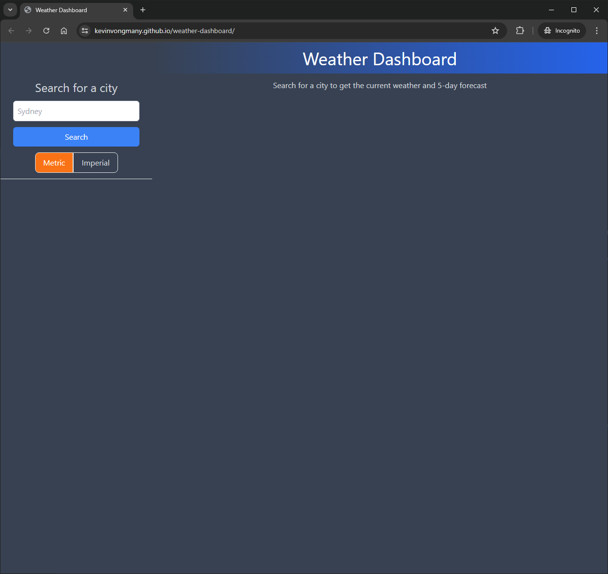
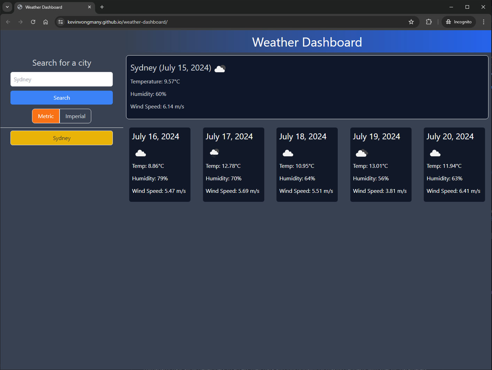
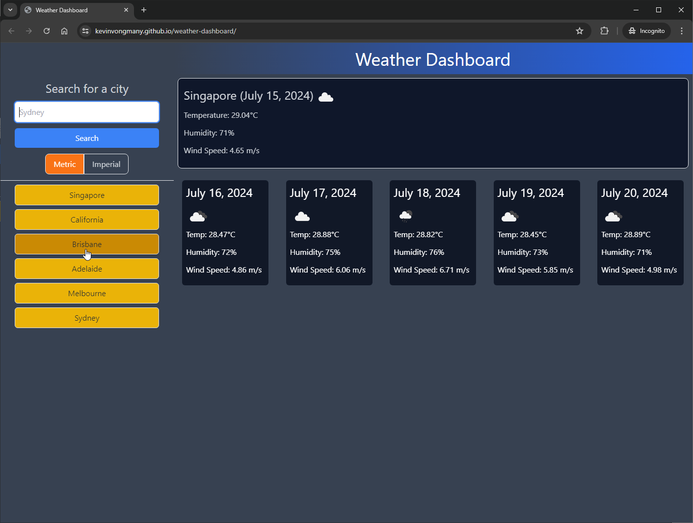
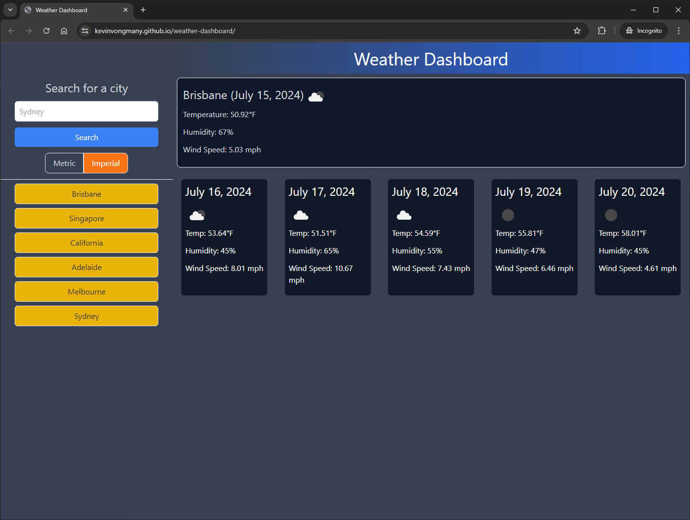
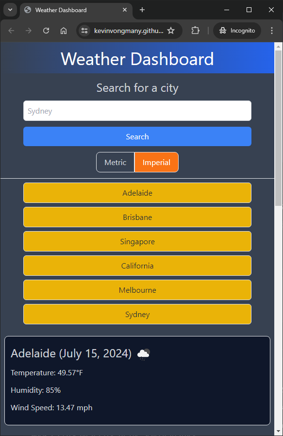

# Weather Dashboard

This repository contains the source code for the Weather Dashboard web application. The Weather Dashboard allows users to view the weather outlook for multiple cities, helping them plan their trips accordingly. With the ability to search for cities and view current and future weather conditions, users can stay informed about the temperature, humidity, wind speed, and more.

The Weather Dashboard is built using Node.js, HTML, CSS, and JavaScript, along with various 3rd party APIs. It utilizes the OpenWeather API to fetch weather data for different cities. The application also incorporates Tailwind CSS for responsive and customizable styling.

To get started with adding further development for the Weather Dashboard, make sure you have Node.js and npm installed on your machine. Then, follow the setup instructions provided in the "Setup" section of this README. Once the development environment is set up, you can run the application locally and start exploring the weather forecasts for your desired cities.

Feel free to explore the codebase and make any contributions or enhancements you see fit. If you encounter any issues or have suggestions, please open an issue on the GitHub repository.

Let's stay informed about the weather and plan our trips with the Weather Dashboard!

## Setup
### Requirements
- Node: v20.14.0
- npm: 10.7.0

### Development Environment
```
npm install
npx tailwindcss -i ./assets/css/custom.css -o ./assets/css/styles.css --watch
```

## Features
- Search for cities and view current weather conditions
- Display future weather forecasts for selected cities
- Show temperature, humidity, and wind speed for each city
- Add cities to search history
- Click on a city in the search history to view its weather conditions again
- Responsive and customizable styling using Tailwind CSS
- Utilize the OpenWeather API to fetch weather data


## External Resources
This application uses a wide array of 3rd party web-driven APIs. See below for the official documentation and GitHub repositories for the resources used within this project.
|API|Documentation|Repository|
|---|---|---|
|[Node 20.14.0](https://nodejs.org/en)|[Docs](https://nodejs.org/docs/latest/api/)|https://github.com/nodejs/node|
|[npm 10.7.0](https://www.npm/)|[Docs](https://docs.npmjs.com/)|https://github.com/npm|
|[Tailwind 3.4.4](https://tailwindcss.com/)|[Docs](https://tailwindcss.com/docs/)|https://github.com/tailwindlabs/tailwindcss|
|[OpenWeather](https://openweathermap.org/) | [Docs](https://openweathermap.org/api)|https://github.com/openweathermap/|

## Samples
Samples of the weather search webapp can be found below:








## Deploy
This repository contains the source code for the webpage, written in NodeJS, HTML, CSS and JavaScript and various 3rd party APIs. The final rendered webpage can be located at https://kevinvongmany.github.io/weather-dashboard/.

Additionally users can access the source code in the final webpage by pressing `F12`, `CTRL+SHIFT+I` (Windows) or `CMD+SHIFT+I` (MacOS) on any Chrome/Firefox browsers (or any Chromium driven browser). Alternatively modern web browsers can access the source code through the context menu (right-click) -> View page source.

## User Story

```
AS A traveler
I WANT to see the weather outlook for multiple cities
SO THAT I can plan a trip accordingly
```

## Acceptance Criteria

```
GIVEN a weather dashboard with form inputs
WHEN I search for a city
THEN I am presented with current and future conditions for that city and that city is added to the search history
WHEN I view current weather conditions for that city
THEN I am presented with the city name, the date, an icon representation of weather conditions, the temperature, the humidity, and the wind speed
WHEN I view future weather conditions for that city
THEN I am presented with a 5-day forecast that displays the date, an icon representation of weather conditions, the temperature, the wind speed, and the humidity
WHEN I click on a city in the search history
THEN I am again presented with current and future conditions for that city
```

